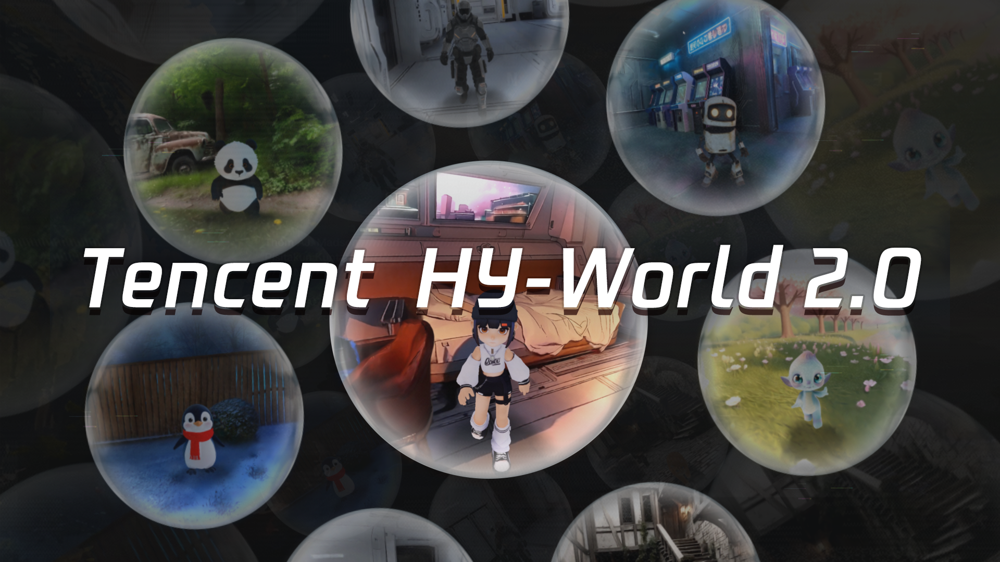
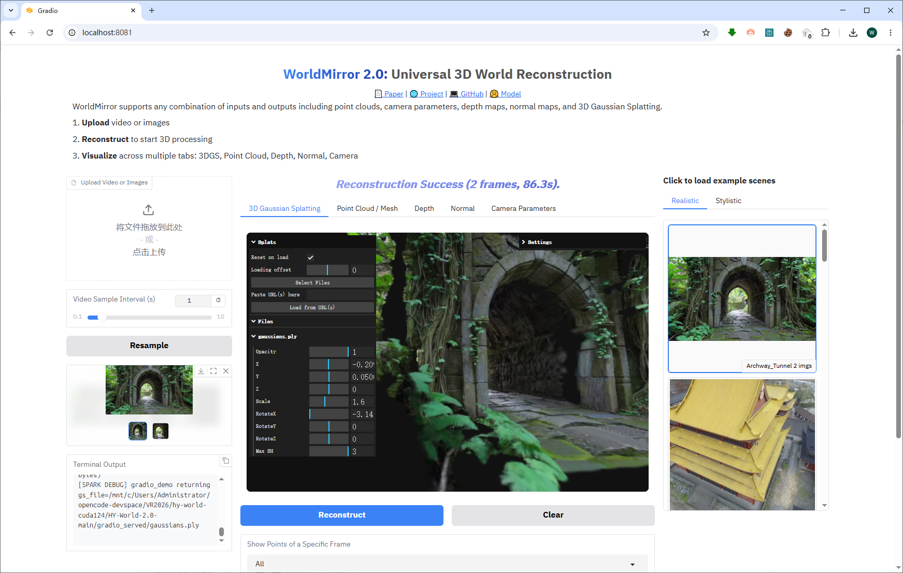
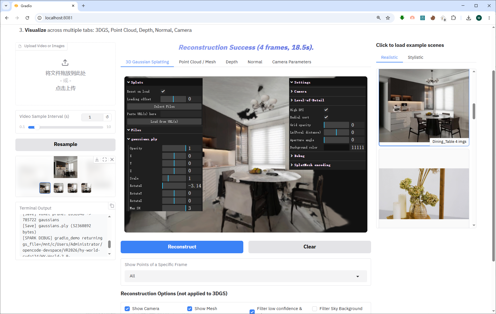
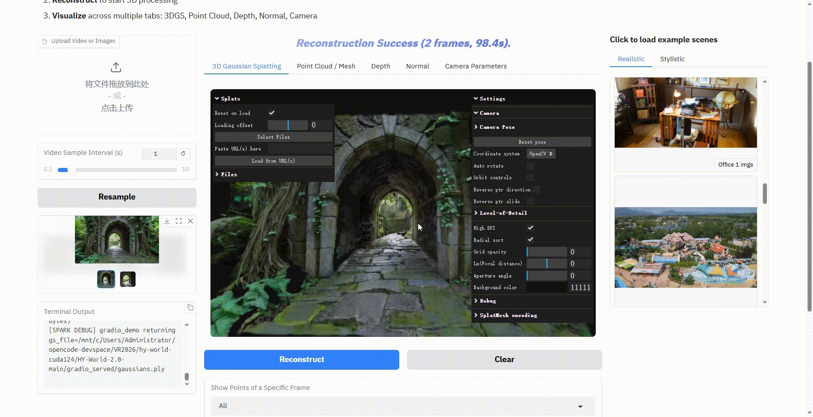
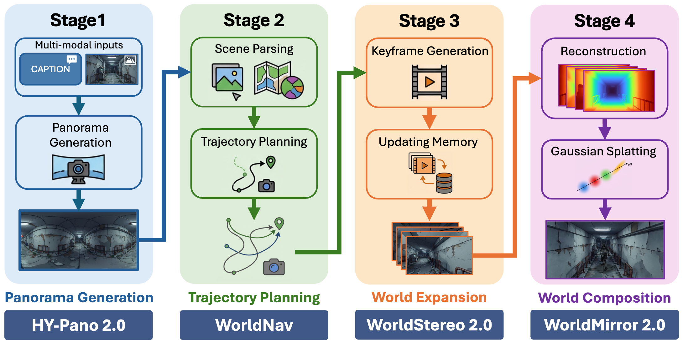
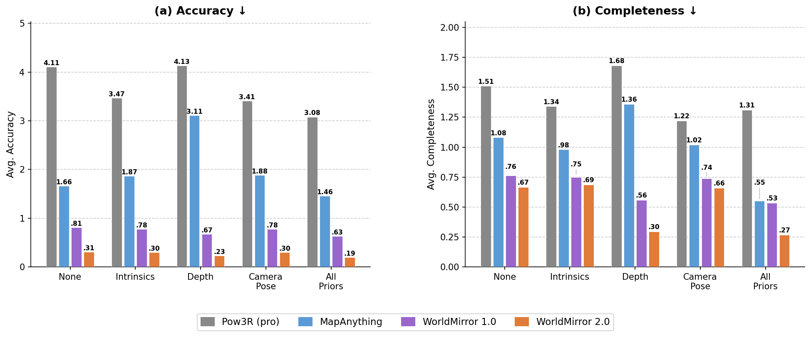

<h1>HY-World-Spark 2.0: A Multi-Modal World Model for Reconstructing, Generating, and Simulating 3D Worlds</h1>

[English](README.md) | [简体中文](README_zh.md)

<p align="center">
  
</p>

<div align="center">
  <a href=https://3d.hunyuan.tencent.com/sceneTo3D target="_blank"></a>
  <a href=https://huggingface.co/tencent/HY-World-2.0 target="_blank"></a>
  <a href=https://3d-models.hunyuan.tencent.com/world/ target="_blank"></a>
  <a href=https://arxiv.org/abs/2604.14268 target="_blank"></a>
   <a href=https://modelscope.cn/models/Tencent-Hunyuan/HY-World-2.0 target="_blank"></a>
  <a href=https://discord.gg/dNBrdrGGMa target="_blank"></a>
  <a href=https://x.com/TencentHunyuan target="_blank"></a>
 <a href="#community-resources" target="_blank"></a>
</div>

<br>
<p align="center">
  <i>"What Is Now Proved Was Once Only Imagined"</i>
</p>

## 🎥 Video
https://github.com/user-attachments/assets/b56f4750-25c9-48fb-83ff-d58526711463

## 🔥 News

- **[May 10, 2026]**: 🎮 Replace the default 3DGS viewer with [Spark.js](https://sparkjs.dev) (from WorldLabs), featuring real-time WebGL2 rendering with full editor panels — camera 6-DoF, Level-of-Detail, debug controls, drag-and-drop, and per-file property adjustment. —— 3DGS 查看器替换为 WorldLabs 的 Spark.js，支持实时 WebGL2 渲染和完整编辑器面板。
- **[May 7, 2026]**: 🖥️ Fix multi-GPU support for odd card counts (e.g. 3 GPUs). DistAttention now pads attention heads automatically and depads after compute, removing the requirement that `num_heads` be divisible by GPU count. —— 修复了对三卡等奇数显卡的支持，注意力头数不再需要被 GPU 数整除。
- **[Coming Soon]**: Release Full HY-World-Spark 2.0 (World Generation) inference code.
- **[Coming Soon]**: Release  (HY-Pano 2.0) model weights & code.
- **[Coming Soon]**: Release （WorldNav） code.
- **[Coming Soon]**: Release (WorldStereo 2.0) model weights & inference code.


## 🎮 Spark.js 3DGS Viewer

We replaced the default Gradio viewer with **[Spark.js](https://sparkjs.dev)** — a high-performance 3D Gaussian Splatting renderer built by WorldLabs. It runs entirely in the browser via **WebGL2 + WASM**, rendering millions of Gaussians at interactive frame rates.

The bundled **lil-gui** editor panels provide real-time control over every rendering parameter:

<p align="center">
  
  
</p>

<p align="center">
  
  
</p>

| Panel | Controls |
|-------|----------|
| **Settings** (right) | Camera 6-DoF (XYZ + rotate), FOV, coord system (OpenCV/OpenGL/Z-up), auto-rotate, orbit controls, Level-of-Detail, blur/AA debugging, background color |
| **Splats** (left) | Per-file opacity, scale, position, rotation, max SH; reset-on-load, URL paste, drag-and-drop |

All parameters update in real time — no rebuild, no reload.


## 📋 Table of Contents
- [🎮 Spark.js 3DGS Viewer](#-sparkjs-3dgs-viewer)
- [📖 Introduction](#-introduction)
- [✨ Highlights](#-highlights)
- [🧩 Architecture](#-architecture)
- [📝 Open-Source Plan](#-open-source-plan)
- [🎁 Model Zoo](#-model-zoo)
- [🤗 Get Started](#-get-started)
- [🔮 Performance](#-performance)
- [🎬 More Examples](#-more-examples)
- [📚 Citation](#-citation)


## 📖 Introduction

**HY-World-Spark 2.0** is a multi-modal world model framework for **world generation** and **world reconstruction**. It accepts diverse input modalities — text, single-view images, multi-view images, and videos — and produces 3D world representations (meshes / Gaussian Splattings). It offers two core capabilities:

- **World Generation** (text / single image &rarr; 3D world): syntheses high-fidelity, navigable 3D scenes through a four-stage method —— a)  with HY-Pano 2.0, b)  with WorldNav, c)  with WorldStereo 2.0, and d)  with WorldMirror 2.0 & 3DGS learning.
- **World Reconstruction** (multi-view images / video &rarr; 3D): Powered by WorldMirror 2.0, a unified feed-forward model that simultaneously predicts depth, surface normals, camera parameters, 3D point clouds, and 3DGS attributes in a single forward pass.

HY-World-Spark 2.0 is an **open-source state-of-the-art** world model.  We will release all model weights, code, and technical details to facilitate reproducibility and advance research in this field.

### Why 3D World Models?

Existing world models, such as Genie 3, Cosmos, and HY-World 1.5 (WorldPlay+WorldCompass), generate pixel-level videos — essentially "watching a movie" that vanishes once playback ends. **HY-World-Spark 2.0 takes a fundamentally different approach**: it directly produces editable, persistent 3D assets (meshes / 3DGS) that can be imported into game engines like Blender/Unity/Unreal Engine/Isaac Sim — more like "building a playable game" than recording a clip. This paradigm shift natively resolves many long-standing pain points of video world models:

|  | Video World Models | 3D World Model (HY-World-Spark 2.0) |
|--|---|---|
| **Output** | Pixel videos (non-editable) | Real 3D assets — meshes / 3DGS (fully editable) |
| **Playable Duration** | Limited (typically 1 min) | Unlimited — assets persist permanently |
| **3D Consistency** | No (flickering, artifacts across views) | Native — inherently consistent in 3D |
| **Real-Time Rendering** | Requires per-frame inference; high latency | Consumer GPUs can render in real time |
| **Controllability** | Weak (imprecise character control, no real physics) | Precise — zero-error control, real physics collision, accurate lighting |
| **Inference Cost** | Accumulates with every interaction | One-time generation; rendering cost ≈ 0 |
| **Engine Compatibility** | ✗ Video files only | ✓ Directly importable into Blender / UE / Isaac Engine |
| | $\color{IndianRed}{\textsf{Watch a video, then it's gone}}$ | $\color{RoyalBlue}{\textbf{Build a world, keep it forever}}$ |


<table align="center" style="border: none;">
  <tr>
    <td align="center" width="50%"></td>
    <td align="center" width="50%"></td>
  </tr>
  <tr>
    <td align="center" width="50%"></td>
    <td align="center" width="50%"></td>
  </tr>
</table>

<p align="center"><em>All above are <strong>real 3D assets</strong> (not generated videos) and entirely created by HY-World-Spark 2.0 -- captured from live real-time interaction.</em></p>

## ✨ Highlights

- **Real 3D Worlds, Not Just Videos**

  Unlike video-only world models (e.g., Genie 3, HY World 1.5), HY-World-Spark 2.0 generates **real 3D assets** — 3DGS, meshes, and point clouds — that are freely explorable, editable, and directly importable into **Unity / Unreal Engine / Isaac**. From a single text prompt or image, create navigable 3D worlds with diverse styles: realistic, cartoon, game, and more.

<p align="center">
  
</p>


- **Instant 3D Reconstruction from Photos & Videos**

  Powered by **WorldMirror 2.0**, a unified feed-forward model that predicts dense point clouds, depth maps, surface normals, camera parameters, and 3DGS from multi-view images or casual videos in a single forward pass. Supports flexible-resolution inference (50K–500K pixels) with SOTA accuracy. Capture a video, get a digital twin.

<p align="center">
  
</p>

- **Interactive Character Exploration**

  Go beyond viewing — **play inside your generated worlds**. HY-World 2.0 supports first-person navigation and third-person character mode, enabling users to freely explore AI-generated streets, buildings, and landscapes with physics-based collision.  Go to [our product page](https://3d.hunyuan.tencent.com/sceneTo3D) for free try (). 

<p align="center">
  
</p>


## 🧩 Architecture
- **Refer to our tech report for more details**

  A systematic pipeline of HY-World-Spark 2.0 — *Panorama Generation* (HY-Pano-2.0) &rarr; *Trajectory Planning* (WorldNav) &rarr; *World Expansion* (WorldStereo 2.0) &rarr; *World Composition* (WorldMirror 2.0 + Splattings Learning) — that automatically transforms text or a single image into a high-fidelity, navigable 3D world (3DGS/mesh outputs).

<p align="center">
  
</p>

## 📝 Open-Source Plan

- ✅ Technical Report
- ✅ WorldMirror 2.0 Code & Model Checkpoints
- ⬜ Full Inference Code for World Generation (WorldNav + World Composition)
- ⬜ Panorama Generation (HY-Pano 2.0) Model & Code — [HunyuanWorld 1.0](https://github.com/Tencent-Hunyuan/HunyuanWorld-1.0) available as interim alternative
- ⬜ World Expansion (WorldStereo 2.0) Model & Code — [WorldStereo](https://github.com/FuchengSu/WorldStereo) available as interim alternative


## 🎁 Model Zoo

### World Reconstruction — WorldMirror Series

| Model | Description | Params | Date | Hugging Face |
|-------|-------------|--------|------|--------------|
| WorldMirror-2 [new] | Multi-view / video &rarr; 3D reconstruction | ~1.2B | 2026 | [Download](https://huggingface.co/tencent/HY-World-2.0/tree/main/HY-WorldMirror-2.0) |
| WorldMirror-1 | Multi-view / video &rarr; 3D reconstruction (legacy) | ~1.2B | 2025 | [Download](https://huggingface.co/tencent/HunyuanWorld-Mirror/tree/main) |

### Panorama Generation — HY-Pano Series

| Model | Description | Params | Date | Hugging Face |
|-------|-------------|--------|------|--------------|
| HY-Pano-2 [new] | Text / image &rarr; 360° panorama | — | Coming Soon | — |

### World Expansion — WorldStereo Series

| Model           | Description | Params | Date | Hugging Face |
|-----------------|-------------|-----|------|--------------|
| WorldStereo-2 [new] | Panorama &rarr;  3DGS world |  —  | Coming Soon | — |

### Spatial Planning — WorldNav Series
| Algorithm           | Description | Params | Date |
|-----------------|-------------|-----|------|
| WorldNav [new] | Panorama &rarr;  Camera Traj. |  —  | Coming Soon | 

We recommend referring to our previous works, [WorldStereo](https://github.com/FuchengSu/WorldStereo) and [WorldMirror](https://github.com/Tencent-Hunyuan/HunyuanWorld-Mirror), for background knowledge on 3D world generation and reconstruction. 

## 🤗 Get Started

### Install Requirements

We recommend CUDA 12.4 for installation.

```bash
# 1. Clone the repository
git clone https://github.com/Tencent-Hunyuan/HY-World-2.0
cd HY-World-2.0

# 2. Create conda environment
conda create -n hyworld2 python=3.10
conda activate hyworld2

# 3. Install PyTorch (CUDA 12.4)
pip install torch==2.4.0 torchvision==0.19.0 --index-url https://download.pytorch.org/whl/cu124

# 4. Install dependencies
pip install -r requirements.txt

# 5. Install FlashAttention
# (Recommended) Install FlashAttention-3
git clone https://github.com/Dao-AILab/flash-attention.git
cd flash-attention/hopper
python setup.py install
cd ../../
rm -rf flash-attention

# For simpler installation, you can also use FlashAttention-2
pip install flash-attn --no-build-isolation
```

### Code Usage — Panorama Generation (HY-Pano-2)

*Coming soon.*

### Code Usage — World Generation (WorldNav, WorldStereo-2, and 3DGS)

*Coming soon.*

**We recommend referring to our previous work, [WorldStereo](https://github.com/FuchengSu/WorldStereo), for the open-source preview version of WorldStereo-2.**

### Code Usage — WorldMirror 2.0
WorldMirror 2.0 supports the following usage modes:

- [Code Usage](#code-usage--worldmirror-20)
- [Gradio App](#gradio-app--worldmirror-20)

We provide a `diffusers`-like Python API for WorldMirror 2.0. Model weights are automatically downloaded from Hugging Face on first run.

```python
from hyworld2.worldrecon.pipeline import WorldMirrorPipeline

pipeline = WorldMirrorPipeline.from_pretrained('tencent/HY-World-2.0')
result = pipeline('path/to/images')
```

**With Prior Injection (Camera & Depth):**

```python
result = pipeline(
    'path/to/images',
    prior_cam_path='path/to/prior_camera.json',
    prior_depth_path='path/to/prior_depth/',
)
```

> For the detailed structure of camera/depth priors and how to prepare them, see [Prior Preparation Guide](DOCUMENTATION.md#prior-injection).

**CLI:**

```bash
# Single GPU
python -m hyworld2.worldrecon.pipeline --input_path path/to/images

# Multi-GPU
torchrun --nproc_per_node=2 -m hyworld2.worldrecon.pipeline \
    --input_path path/to/images \
    --use_fsdp --enable_bf16
```

> **Important:** In multi-GPU mode, the number of input images must be **>= the number of GPUs**. For example, with `--nproc_per_node=8`, provide at least 8 images.

### Gradio App — WorldMirror 2.0

We provide an interactive [Gradio](https://www.gradio.app/) web demo for WorldMirror 2.0. Upload images or videos and visualize 3DGS, point clouds, depth maps, normal maps, and camera parameters in your browser.

```bash
# Single GPU
python -m hyworld2.worldrecon.gradio_app

# Multi-GPU
torchrun --nproc_per_node=2 -m hyworld2.worldrecon.gradio_app \
    --use_fsdp --enable_bf16
```

For the full list of Gradio app arguments (port, share, local checkpoints, etc.), see [DOCUMENTATION.md](DOCUMENTATION.md#gradio-app).


## 🔮 Performance

For full benchmark results, please refer to the [technical report](https://3d-models.hunyuan.tencent.com/world/).

### WorldStereo 2.0 — Camera Control

<table>
  <thead>
    <tr>
      <th rowspan="2">Methods</th>
      <th colspan="3" align="center">Camera Metrics</th>
      <th colspan="4" align="center">Visual Quality</th>
    </tr>
    <tr>
      <th>RotErr ↓</th><th>TransErr ↓</th><th>ATE ↓</th>
      <th>Q-Align ↑</th><th>CLIP-IQA+ ↑</th><th>Laion-Aes ↑</th><th>CLIP-I ↑</th>
    </tr>
  </thead>
  <tbody>
    <tr><td>SEVA</td><td>1.690</td><td>1.578</td><td>2.879</td><td>3.232</td><td>0.479</td><td>4.623</td><td>77.16</td></tr>
    <tr><td>Gen3C</td><td>0.944</td><td>1.580</td><td>2.789</td><td>3.353</td><td>0.489</td><td>4.863</td><td>82.33</td></tr>
    <tr><td>WorldStereo</td><td>0.762</td><td>1.245</td><td>2.141</td><td>4.149</td><td><b>0.547</b></td><td>5.257</td><td>89.05</td></tr>
    <tr><td><b>WorldStereo 2.0</b></td><td><b>0.492</b></td><td><b>0.968</b></td><td><b>1.768</b></td><td><b>4.205</b></td><td>0.544</td><td><b>5.266</b></td><td><b>89.43</b></td></tr>
  </tbody>
</table>

### WorldStereo 2.0 — Single-View-Generated Reconstruction

<table>
  <thead>
    <tr>
      <th rowspan="2">Methods</th>
      <th colspan="4">Tanks-and-Temples</th>
      <th colspan="4">MipNeRF360</th>
    </tr>
    <tr>
      <th>Precision ↑</th>
      <th>Recall ↑</th>
      <th>F1-Score ↑</th>
      <th>AUC ↑</th>
      <th>Precision ↑</th>
      <th>Recall ↑</th>
      <th>F1-Score ↑</th>
      <th>AUC ↑</th>
    </tr>
  </thead>
  <tbody align="center">
    <tr>
      <td align="left">SEVA</td>
      <td>33.59</td>
      <td>35.34</td>
      <td>36.73</td>
      <td>51.03</td>
      <td>22.38</td>
      <td>55.63</td>
      <td>28.75</td>
      <td>46.81</td>
    </tr>
    <tr>
      <td align="left">Gen3C</td>
      <td><u>46.73</u></td>
      <td>25.51</td>
      <td>31.24</td>
      <td>42.44</td>
      <td>23.28</td>
      <td><strong>75.37</strong></td>
      <td>35.26</td>
      <td>52.10</td>
    </tr>
    <tr>
      <td align="left">Lyra</td>
      <td><strong>50.38</strong></td>
      <td>28.67</td>
      <td>32.54</td>
      <td>43.05</td>
      <td>30.02</td>
      <td>58.60</td>
      <td>36.05</td>
      <td>49.89</td>
    </tr>
    <tr>
      <td align="left">FlashWorld</td>
      <td>26.58</td>
      <td>20.72</td>
      <td>22.29</td>
      <td>30.45</td>
      <td>35.97</td>
      <td>53.77</td>
      <td>42.60</td>
      <td>53.86</td>
    </tr>
    <tr>
      <td align="left">WorldStereo 2.0</td>
      <td>43.62</td>
      <td><u>41.02</u></td>
      <td><u>41.43</u></td>
      <td><u>58.19</u></td>
      <td><strong>43.19</strong></td>
      <td><u>65.32</u></td>
      <td><strong>51.27</strong></td>
      <td><strong>65.79</strong></td>
    </tr>
    <tr>
      <td align="left">WorldStereo 2.0 (DMD)</td>
      <td>40.41</td>
      <td><strong>44.41</strong></td>
      <td><strong>43.16</strong></td>
      <td><strong>60.09</strong></td>
      <td><u>42.34</u></td>
      <td>64.83</td>
      <td><u>50.52</u></td>
      <td><u>65.64</u></td>
    </tr>
  </tbody>
</table>

### WorldMirror 2.0 — Point Map Reconstruction

**Point Map Reconstruction on 7-Scenes, NRGBD, and DTU.** We report the mean Accuracy and Completeness of WorldMirror under different input configurations. **Bold** results are best. "L / M / H" denote low / medium / high inference resolution. "+ all priors" denotes injection of camera extrinsics, camera intrinsics, and depth priors.

<table>
  <thead>
    <tr>
      <th rowspan="2">Method</th>
      <th colspan="2" align="center">7-Scenes <sub>(scene)</sub></th>
      <th colspan="2" align="center">NRGBD <sub>(scene)</sub></th>
      <th colspan="2" align="center">DTU <sub>(object)</sub></th>
    </tr>
    <tr>
      <th>Acc. ↓</th><th>Comp. ↓</th>
      <th>Acc. ↓</th><th>Comp. ↓</th>
      <th>Acc. ↓</th><th>Comp. ↓</th>
    </tr>
  </thead>
  <tbody>
    <tr><td colspan="7"><em>WorldMirror 1.0</em></td></tr>
    <tr><td>&nbsp;&nbsp;L</td><td>0.043</td><td>0.055</td><td>0.046</td><td>0.049</td><td>1.476</td><td>1.768</td></tr>
    <tr><td>&nbsp;&nbsp;L + all priors</td><td>0.021</td><td>0.026</td><td>0.022</td><td>0.020</td><td>1.347</td><td>1.392</td></tr>
    <tr><td>&nbsp;&nbsp;M</td><td>0.043</td><td>0.049</td><td>0.041</td><td>0.045</td><td>1.017</td><td>1.780</td></tr>
    <tr><td>&nbsp;&nbsp;M + all priors</td><td>0.018</td><td>0.023</td><td>0.016</td><td>0.014</td><td>0.735</td><td>0.935</td></tr>
    <tr><td>&nbsp;&nbsp;H</td><td>0.079</td><td>0.087</td><td>0.077</td><td>0.093</td><td>2.271</td><td>2.113</td></tr>
    <tr><td>&nbsp;&nbsp;H + all priors</td><td>0.042</td><td>0.041</td><td>0.078</td><td>0.082</td><td>1.773</td><td>1.478</td></tr>
    <tr><td colspan="7"></td></tr>
    <tr><td colspan="7"><em>WorldMirror 2.0</em></td></tr>
    <tr><td>&nbsp;&nbsp;L</td><td>0.041</td><td>0.052</td><td>0.047</td><td>0.058</td><td>1.352</td><td>2.009</td></tr>
    <tr><td>&nbsp;&nbsp;L + all priors</td><td>0.019</td><td>0.024</td><td>0.017</td><td>0.015</td><td>1.100</td><td>1.201</td></tr>
    <tr><td>&nbsp;&nbsp;M</td><td>0.033</td><td>0.046</td><td>0.039</td><td>0.047</td><td>1.005</td><td>1.892</td></tr>
    <tr><td>&nbsp;&nbsp;M + all priors</td><td>0.013</td><td>0.017</td><td><b>0.013</b></td><td><b>0.013</b></td><td>0.690</td><td>0.876</td></tr>
    <tr><td>&nbsp;&nbsp;H</td><td>0.037</td><td>0.040</td><td>0.046</td><td>0.053</td><td>0.845</td><td>1.904</td></tr>
    <tr><td>&nbsp;&nbsp;<b>H + all priors</b></td><td><b>0.012</b></td><td><b>0.016</b></td><td>0.015</td><td>0.016</td><td><b>0.554</b></td><td><b>0.771</b></td></tr>
  </tbody>
</table>
 
### WorldMirror 2.0 — Prior Comparison

**Comparison with Pow3R and MapAnything under Different Prior Conditions.** Results are averaged on 7-Scenes, NRGBD, and DTU datasets. Pow3R (pro) refers to the original Pow3R with Procrustes alignment.


<p align="center">
  
</p>


## 🎬 More Examples

<table align="center" style="border: none;">
  <tr>
    <td align="center" width="50%"></td>
    <td align="center" width="50%"></td>
  </tr>
  <tr>
    <td align="center" width="50%"></td>
    <td align="center" width="50%"></td>
  </tr>
  <tr>
    <td align="center" width="50%"></td>
    <td align="center" width="50%"></td>
  </tr>
</table>


## 📖 Documentation

For detailed usage guides, parameter references, output format specifications, and prior injection instructions, see **[DOCUMENTATION.md](DOCUMENTATION.md)**.


## 📚 Citation

If you find HunyuanWorld 2.0 useful for your research, please cite:

```bibtex
@article{hyworld22026,
  title={HY-World-Spark 2.0: A Multi-Modal World Model for Reconstructing, Generating, and Simulating 3D Worlds},
  author={Team HY-World-Spark},
  journal={arXiv preprint},
  year={2026}
}

@article{hunyuanworld2025tencent,
    title={HunyuanWorld 1.0: Generating Immersive, Explorable, and Interactive 3D Worlds from Words or Pixels},
    author={Team HunyuanWorld},
    year={2025},
    journal={arXiv preprint}
}
```

## 📧 Contact

Please send emails to tengfeiwang12@gmail.com or willzhou@live.com for questions or feedback.


## 🙏 Acknowledgements

We would like to thank [HunyuanWorld 1.0](https://github.com/Tencent-Hunyuan/HunyuanWorld-1.0), [WorldMirror](https://github.com/Tencent-Hunyuan/HunyuanWorld-Mirror), [WorldPlay](https://github.com/Tencent-Hunyuan/HY-WorldPlay), [WorldStereo](https://github.com/FuchengSu/WorldStereo), [HunyuanImage](https://github.com/Tencent-Hunyuan/HunyuanImage-3.0) for their great work.
