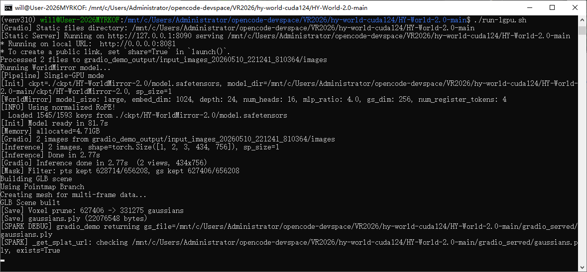
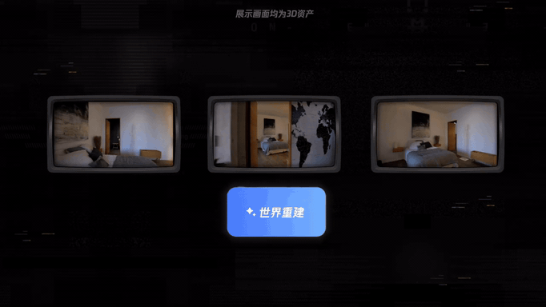

<h1>HY-World-Spark 2.0：A Multi-Modal World Model for Reconstructing, Generating, and Simulating 3D Worlds</h1>

[English](README.md) | [简体中文](README_zh.md)

<p align="center">
  
</p>

<div align="center">
  <a href=https://3d.hunyuan.tencent.com/sceneTo3D target="_blank"></a>
  <a href=https://huggingface.co/tencent/HY-World-2.0 target="_blank"></a>
  <a href=https://3d-models.hunyuan.tencent.com/world/ target="_blank"></a>
  <a href=https://arxiv.org/abs/2604.14268 target="_blank"></a>
   <a href=https://modelscope.cn/models/Tencent-Hunyuan/HY-World-2.0 target="_blank"></a>
  <a href=https://discord.gg/dNBrdrGGMa target="_blank"></a>
  <a href=https://x.com/TencentHunyuan target="_blank"></a>
 <a href="#community-resources" target="_blank"></a>
</div>

<br>
<p align="center">
  <i>"What Is Now Proved Was Once Only Imagined"</i>
</p>

## 🎥 视频

https://github.com/user-attachments/assets/b56f4750-25c9-48fb-83ff-d58526711463

## 🔥 最新动态

- **[2026年5月10日]**：🎮 3DGS 查看器替换为 [Spark.js](https://sparkjs.dev)（WorldLabs），支持实时 WebGL2 渲染和完整编辑器面板（相机6自由度、多级细节、调试控制、拖放、逐文件属性调节）。—— Replaced the default 3DGS viewer with Spark.js from WorldLabs, featuring real-time WebGL2 rendering with full editor panels.
- **[2026年5月7日]**：🖥️ 修复了对三卡等奇数显卡的支持。DistAttention 自动对注意力头数做 padding，计算完成后再 depad，不再要求 `num_heads` 能被 GPU 数整除。—— Fixed multi-GPU support for odd card counts (e.g. 3 GPUs). DistAttention now pads/depads attention heads automatically.
- **[2026年4月16日]**：🚀 发布 HY-World-Spark 2.0 技术报告及部分代码！
- **[2026年4月16日]**：🤗 开源 WorldMirror 2.0 推理代码和模型权重！
- **[即将发布]**：发布完整的 HY-World-Spark 2.0（World Generation）推理代码。
- **[即将发布]**：发布 （HY-Pano 2.0）模型权重和代码。
- **[即将发布]**：发布 （WorldNav）代码。
- **[即将发布]**：发布 （WorldStereo 2.0）模型权重和推理代码。


## 🎮 Spark.js 3DGS 查看器

我们将默认的 Gradio 查看器替换为 **[Spark.js](https://sparkjs.dev)** —— 由 WorldLabs 构建的高性能 3D Gaussian Splatting 渲染器。它通过 **WebGL2 + WASM** 在浏览器中运行，以交互帧率渲染百万级高斯点云。

内置的 **lil-gui** 编辑器面板可实时控制所有渲染参数：

<p align="center">
  
  
</p>

<p align="center">
  
  
</p>

<p align="center">
  
</p>

| 面板 | 控制项 |
|------|--------|
| **Settings**（右侧） | 相机 6 自由度（XYZ + 旋转）、FOV、坐标系统（OpenCV/OpenGL/Z-up）、自动旋转、轨道控制、多级细节、模糊/AA 调试、背景颜色 |
| **Splats**（左侧） | 逐文件透明度、缩放、位置、旋转、最大 SH 阶数；载入时重置、URL 粘贴、拖放载入 |

所有参数实时生效 — 无需重新编译或重新加载。


## 📋 目录
- [🎮 Spark.js 3DGS 查看器](#-sparkjs-3dgs-查看器)
- [📖 介绍](#-介绍)
- [✨ 亮点](#-亮点)
- [🧩 架构](#-架构)
- [📝 开源计划](#-开源计划)
- [🎁 模型库](#-模型库)
- [🤗 快速开始](#-快速开始)
- [🔮 性能表现](#-性能表现)
- [🎬 更多示例](#-更多示例)
- [📚 引用](#-引用)


## 📖 介绍

**HY-World-Spark 2.0** 是一个面向**世界生成**和**世界重建**的多模态世界模型框架。它接受多种输入模态——文本、单视图图像、多视图图像和视频——并生成3D世界表示（网格 / 3D高斯点云）。它提供两大核心能力：

- **世界生成**（文本 / 单张图像 &rarr; 3D 世界）：通过四阶段方法合成高保真、可导航的3D场景——a) （HY-Pano 2.0），b) （WorldNav），c) （WorldStereo 2.0），d) （WorldMirror 2.0 + 3DGS 学习）。
- **世界重建**（多视图图像 / 视频 &rarr; 3D）：由 WorldMirror 2.0 驱动，这是一个统一的前馈模型，能够在单次前向传播中同时预测深度、表面法线、相机参数、3D点云和3DGS属性。

HY-World-Spark 2.0 是**开源的**3D世界模型，我们将发布所有模型权重、代码和技术细节，以促进可复现性和推动该领域的研究进展。

### 为什么需要3D世界模型？

现有的世界模型（如 Genie 3、Cosmos、HY-World 1.5（WorldPlay+WorldCompass））生成的是像素级视频——本质上是"看一部电影"，播放结束即消失。**HY-World-Spark 2.0 采用了完全不同的方法**：它直接生成可编辑、可持久化的3D资产（网格 / 3DGS），可以直接导入到 Blender/Unity/Unreal Engine/Isaac Sim 等游戏引擎中——更像是"构建一个可玩的游戏"，而非录制一段视频。这种范式转变从根本上解决了视频世界模型的许多长期痛点：

|  | 视频世界模型 | 3D 世界模型（HY-World-Spark 2.0） |
|--|---|---|
| **输出** | 像素视频（不可编辑） | 真实 3D 资产——网格 / 3DGS（完全可编辑） |
| **可交互时长** | 有限（通常 1 分钟） | 无限——资产永久保存 |
| **3D 一致性** | 无保证（闪烁、跨视角伪影） | 原生一致——内在3D一致性 |
| **实时渲染** | 需要逐帧推理；延迟高 | 消费级 GPU 即可实时渲染 |
| **可控性** | 弱（角色控制不精确，无真实物理） | 精确——零误差控制、真实物理碰撞、准确光照 |
| **推理成本** | 随每次交互累积 | 一次生成；渲染成本 ≈ 0 |
| **引擎兼容性** | ✗ 仅视频文件 | ✓ 可直接导入 Blender / UE / Isaac Engine |
| | $\color{IndianRed}{\textsf{看完视频，即刻消失}}$ | $\color{RoyalBlue}{\textbf{构建世界，永久保留}}$ |


<table align="center" style="border: none;">
  <tr>
    <td align="center" width="50%"></td>
    <td align="center" width="50%"></td>
  </tr>
  <tr>
    <td align="center" width="50%"></td>
    <td align="center" width="50%"></td>
  </tr>
</table>

<p align="center"><em>以上均为<strong>真实3D资产</strong>（非生成视频），完全由 HY-World-Spark 2.0 创建——截取自实时交互画面。</em></p>

## ✨ 亮点

- **真实3D世界，而非仅仅是视频**

  与纯视频世界模型（如 Genie 3、HY World 1.5）不同，HY-World-Spark 2.0 生成**真实3D资产**——3DGS、网格和点云——可自由浏览、编辑，并直接导入 **Unity / Unreal Engine / Isaac**。从一段文本提示或一张图像出发，即可创建多种风格的可导航3D世界：写实、卡通、游戏等。

<p align="center">
  
</p>


- **从照片和视频即时3D重建**

  由 **WorldMirror 2.0** 驱动，这是一个统一的前馈模型，能够在单次前向传播中从多视图图像或随手拍摄的视频中预测稠密点云、深度图、表面法线、相机参数和3DGS。支持灵活分辨率推理（50K–500K 像素），精度达到 SOTA 水平。拍摄一段视频，即可获得数字孪生。

<p align="center">
  
</p>

- **交互式角色探索**

  不仅仅是观看——**在生成的世界中自由漫游**。HY-World 2.0 支持第一人称导航和第三人称角色模式，用户可以在 AI 生成的街道、建筑和景观中自由探索，并具备基于物理的碰撞效果。前往[我们的产品页面](https://3d.hunyuan.tencent.com/sceneTo3D)免费体验 ()。

<p align="center">
  
</p>

## 🧩 架构
- **详细信息请参阅我们的技术报告**

  HY-World-Spark 2.0 的系统化流水线——*全景生成*（HY-Pano-2.0）&rarr; *轨迹规划*（WorldNav）&rarr; *世界扩展*（WorldStereo 2.0）&rarr; *世界组合*（WorldMirror 2.0 + Splattings Learning）——能够自动将文本或单张图像转化为高保真、可漫游的3D世界（3DGS/网格输出）。

<p align="center">
  
</p>

## 📝 开源计划

- ✅ 技术报告
- ✅ WorldMirror 2.0 代码和模型权重
- ⬜ 世界生成完整推理代码（WorldNav + World Composition）
- ⬜ 全景生成（HY-Pano 2.0）模型和代码 — 可使用 [HunyuanWorld 1.0](https://github.com/Tencent-Hunyuan/HunyuanWorld-1.0)的全景图生成 作为临时替代
- ⬜ 世界扩展（WorldStereo 2.0）模型和代码 — 可使用 [WorldStereo](https://github.com/FuchengSu/WorldStereo) 作为临时替代


## 🎁 模型库

### 世界重建 — WorldMirror 系列

| 模型 | 描述 | 参数量 | 日期 | Hugging Face |
|------|------|--------|------|--------------|
| WorldMirror-2 [new] | 多视图 / 视频 &rarr; 3D 重建 | ~1.2B | 2026 | [下载](https://huggingface.co/tencent/HY-World-2.0/tree/main/HY-WorldMirror-2.0) |
| WorldMirror-1 | 多视图 / 视频 &rarr; 3D 重建（旧版） | ~1.2B | 2025 | [下载](https://huggingface.co/tencent/HunyuanWorld-Mirror/tree/main) |

### 全景生成 — HY_Pano 系列

| 模型 | 描述 | 参数量 | 日期 | Hugging Face |
|------|------|--------|------|--------------|
| HY-Pano-2 [new] | 文本 / 图像 &rarr; 360° 全景 | — | 即将发布 | — |

### 世界生成 - WorldStereo 系列

| 模型            | 描述 | 参数量 | 日期 | Hugging Face |
|-----------------|------|--------|------|--------------|
| WorldStereo-2 [new] | 全景 &rarr; 完整 3DGS 世界 | — | 即将发布 | — |

### 空间规划 - WorldNav系列

| 算法            | 描述 | 参数量 | 日期 |  
|-----------------|------|--------|------| 
| WorldNav [new] | 全景 &rarr; 完整 3DGS 世界 | — | 即将发布 |  


我们建议参考我们之前的工作 [WorldStereo](https://github.com/FuchengSu/WorldStereo) 和 [WorldMirror](https://github.com/Tencent-Hunyuan/HunyuanWorld-Mirror)，以了解3D世界生成和重建的背景知识。

## 🤗 快速开始

### 安装依赖

我们建议使用 CUDA 12.4 进行安装。

```bash
# 1. 克隆仓库
git clone https://github.com/Tencent-Hunyuan/HY-World-2.0
cd HY-World-2.0

# 2. 创建 conda 环境
conda create -n hyworld2 python=3.10
conda activate hyworld2

# 3. 安装 PyTorch（CUDA 12.4）
pip install torch==2.4.0 torchvision==0.19.0 --index-url https://download.pytorch.org/whl/cu124

# 4. 安装依赖
pip install -r requirements.txt

# 5. 安装 FlashAttention
# （推荐）安装 FlashAttention-3
git clone https://github.com/Dao-AILab/flash-attention.git
cd flash-attention/hopper
python setup.py install
cd ../../
rm -rf flash-attention

# 也可以使用更简单的 FlashAttention-2 安装方式
pip install flash-attn --no-build-isolation
```

### 代码使用 — 全景生成（HY-Pano-2）

*即将发布。*

### 代码使用 — 世界生成（WorldNav、WorldStereo-2 和 3DGS）

*即将发布。*

**我们建议参考之前的工作 [WorldStereo](https://github.com/FuchengSu/WorldStereo)，作为 WorldStereo-2 的开源预览版本。**

### 代码使用 — WorldMirror 2.0
WorldMirror 2.0 支持以下使用方式：

- [代码使用](#代码使用--worldmirror-20)
- [Gradio 应用](#gradio-应用--worldmirror-20)

我们提供了类似 `diffusers` 的 Python API。模型权重将在首次运行时自动从 Hugging Face 下载。

```python
from hyworld2.worldrecon.pipeline import WorldMirrorPipeline

pipeline = WorldMirrorPipeline.from_pretrained('tencent/HY-World-2.0')
result = pipeline('path/to/images')
```

**使用先验注入（相机位姿和深度）：**

```python
result = pipeline(
    'path/to/images',
    prior_cam_path='path/to/prior_camera.json',
    prior_depth_path='path/to/prior_depth/',
)
```

> 关于相机/深度先验的详细格式和准备方法，请参阅[先验准备指南](DOCUMENTATION_zh.md#先验注入)。

**命令行：**

```bash
# 单卡推理
python -m hyworld2.worldrecon.pipeline --input_path path/to/images

# 多卡推理
torchrun --nproc_per_node=2 -m hyworld2.worldrecon.pipeline \
    --input_path path/to/images \
    --use_fsdp --enable_bf16
```

> **重要提示：** 在多卡模式下，输入图像数量必须 **>= GPU 数量**。例如，使用 `--nproc_per_node=8` 时，需要提供至少 8 张图像。

### Gradio 应用 — WorldMirror 2.0

我们提供了一个交互式 [Gradio](https://www.gradio.app/) Web 演示。上传图像或视频，即可在浏览器中可视化 3DGS、点云、深度图、法线图和相机参数。

```bash
# 单卡
python -m hyworld2.worldrecon.gradio_app

# 多卡
torchrun --nproc_per_node=2 -m hyworld2.worldrecon.gradio_app \
    --use_fsdp --enable_bf16
```

关于 Gradio 应用的完整参数列表（端口、分享、本地检查点等），请参阅 [DOCUMENTATION_zh.md](DOCUMENTATION_zh.md#gradio-应用)。


## 🔮 性能表现

完整的基准测试结果请参阅[技术报告](https://3d-models.hunyuan.tencent.com/world/)。

### WorldStereo 2.0 — 相机控制

<table>
  <thead>
    <tr>
      <th rowspan="2">方法</th>
      <th colspan="3" align="center">相机指标</th>
      <th colspan="4" align="center">视觉质量</th>
    </tr>
    <tr>
      <th>RotErr ↓</th><th>TransErr ↓</th><th>ATE ↓</th>
      <th>Q-Align ↑</th><th>CLIP-IQA+ ↑</th><th>Laion-Aes ↑</th><th>CLIP-I ↑</th>
    </tr>
  </thead>
  <tbody>
    <tr><td>SEVA</td><td>1.690</td><td>1.578</td><td>2.879</td><td>3.232</td><td>0.479</td><td>4.623</td><td>77.16</td></tr>
    <tr><td>Gen3C</td><td>0.944</td><td>1.580</td><td>2.789</td><td>3.353</td><td>0.489</td><td>4.863</td><td>82.33</td></tr>
    <tr><td>WorldStereo</td><td>0.762</td><td>1.245</td><td>2.141</td><td>4.149</td><td><b>0.547</b></td><td>5.257</td><td>89.05</td></tr>
    <tr><td><b>WorldStereo 2.0</b></td><td><b>0.492</b></td><td><b>0.968</b></td><td><b>1.768</b></td><td><b>4.205</b></td><td>0.544</td><td><b>5.266</b></td><td><b>89.43</b></td></tr>
  </tbody>
</table>

### WorldStereo 2.0 — 基于单帧输入的生成式重建

<table>
  <thead>
    <tr>
      <th rowspan="2">Methods</th>
      <th colspan="4">Tanks-and-Temples</th>
      <th colspan="4">MipNeRF360</th>
    </tr>
    <tr>
      <th>Precision ↑</th>
      <th>Recall ↑</th>
      <th>F1-Score ↑</th>
      <th>AUC ↑</th>
      <th>Precision ↑</th>
      <th>Recall ↑</th>
      <th>F1-Score ↑</th>
      <th>AUC ↑</th>
    </tr>
  </thead>
  <tbody align="center">
    <tr>
      <td align="left">SEVA</td>
      <td>33.59</td>
      <td>35.34</td>
      <td>36.73</td>
      <td>51.03</td>
      <td>22.38</td>
      <td>55.63</td>
      <td>28.75</td>
      <td>46.81</td>
    </tr>
    <tr>
      <td align="left">Gen3C</td>
      <td><u>46.73</u></td>
      <td>25.51</td>
      <td>31.24</td>
      <td>42.44</td>
      <td>23.28</td>
      <td><strong>75.37</strong></td>
      <td>35.26</td>
      <td>52.10</td>
    </tr>
    <tr>
      <td align="left">Lyra</td>
      <td><strong>50.38</strong></td>
      <td>28.67</td>
      <td>32.54</td>
      <td>43.05</td>
      <td>30.02</td>
      <td>58.60</td>
      <td>36.05</td>
      <td>49.89</td>
    </tr>
    <tr>
      <td align="left">FlashWorld</td>
      <td>26.58</td>
      <td>20.72</td>
      <td>22.29</td>
      <td>30.45</td>
      <td>35.97</td>
      <td>53.77</td>
      <td>42.60</td>
      <td>53.86</td>
    </tr>
    <tr>
      <td align="left">WorldStereo 2.0</td>
      <td>43.62</td>
      <td><u>41.02</u></td>
      <td><u>41.43</u></td>
      <td><u>58.19</u></td>
      <td><strong>43.19</strong></td>
      <td><u>65.32</u></td>
      <td><strong>51.27</strong></td>
      <td><strong>65.79</strong></td>
    </tr>
    <tr>
      <td align="left">WorldStereo 2.0 (DMD)</td>
      <td>40.41</td>
      <td><strong>44.41</strong></td>
      <td><strong>43.16</strong></td>
      <td><strong>60.09</strong></td>
      <td><u>42.34</u></td>
      <td>64.83</td>
      <td><u>50.52</u></td>
      <td><u>65.64</u></td>
    </tr>
  </tbody>
</table>


### WorldMirror 2.0 — 点云重建

**在 7-Scenes、NRGBD 和 DTU 上的点图重建。** 我们报告了 WorldMirror 在不同输入配置下的平均精度和完整度。**加粗**为最优结果。"L / M / H" 分别代表低 / 中 / 高推理分辨率。"+ all priors" 表示同时注入相机外参、相机内参和深度先验。

<table>
  <thead>
    <tr>
      <th rowspan="2">方法</th>
      <th colspan="2" align="center">7-Scenes <sub>(场景)</sub></th>
      <th colspan="2" align="center">NRGBD <sub>(场景)</sub></th>
      <th colspan="2" align="center">DTU <sub>(物体)</sub></th>
    </tr>
    <tr>
      <th>Acc. ↓</th><th>Comp. ↓</th>
      <th>Acc. ↓</th><th>Comp. ↓</th>
      <th>Acc. ↓</th><th>Comp. ↓</th>
    </tr>
  </thead>
  <tbody>
    <tr><td colspan="7"><em>WorldMirror 1.0</em></td></tr>
    <tr><td>&nbsp;&nbsp;L</td><td>0.043</td><td>0.055</td><td>0.046</td><td>0.049</td><td>1.476</td><td>1.768</td></tr>
    <tr><td>&nbsp;&nbsp;L + all priors</td><td>0.021</td><td>0.026</td><td>0.022</td><td>0.020</td><td>1.347</td><td>1.392</td></tr>
    <tr><td>&nbsp;&nbsp;M</td><td>0.043</td><td>0.049</td><td>0.041</td><td>0.045</td><td>1.017</td><td>1.780</td></tr>
    <tr><td>&nbsp;&nbsp;M + all priors</td><td>0.018</td><td>0.023</td><td>0.016</td><td>0.014</td><td>0.735</td><td>0.935</td></tr>
    <tr><td>&nbsp;&nbsp;H</td><td>0.079</td><td>0.087</td><td>0.077</td><td>0.093</td><td>2.271</td><td>2.113</td></tr>
    <tr><td>&nbsp;&nbsp;H + all priors</td><td>0.042</td><td>0.041</td><td>0.078</td><td>0.082</td><td>1.773</td><td>1.478</td></tr>
    <tr><td colspan="7"></td></tr>
    <tr><td colspan="7"><em>WorldMirror 2.0</em></td></tr>
    <tr><td>&nbsp;&nbsp;L</td><td>0.041</td><td>0.052</td><td>0.047</td><td>0.058</td><td>1.352</td><td>2.009</td></tr>
    <tr><td>&nbsp;&nbsp;L + all priors</td><td>0.019</td><td>0.024</td><td>0.017</td><td>0.015</td><td>1.100</td><td>1.201</td></tr>
    <tr><td>&nbsp;&nbsp;M</td><td>0.033</td><td>0.046</td><td>0.039</td><td>0.047</td><td>1.005</td><td>1.892</td></tr>
    <tr><td>&nbsp;&nbsp;M + all priors</td><td>0.013</td><td>0.017</td><td><b>0.013</b></td><td><b>0.013</b></td><td>0.690</td><td>0.876</td></tr>
    <tr><td>&nbsp;&nbsp;H</td><td>0.037</td><td>0.040</td><td>0.046</td><td>0.053</td><td>0.845</td><td>1.904</td></tr>
    <tr><td>&nbsp;&nbsp;<b>H + all priors</b></td><td><b>0.012</b></td><td><b>0.016</b></td><td>0.015</td><td>0.016</td><td><b>0.554</b></td><td><b>0.771</b></td></tr>
  </tbody>
</table>
 
### WorldMirror 2.0 — 先验对比

**WorldMirror 与 Pow3R、MapAnything 在不同先验条件下的对比。** 结果为 7-Scenes、NRGBD 和 DTU 数据集上的平均值。Pow3R (pro) 指使用 Procrustes 对齐的原版 Pow3R。


<p align="center">
  
</p>


## 🎬 更多示例

<table align="center" style="border: none;">
  <tr>
    <td align="center" width="50%"></td>
    <td align="center" width="50%"></td>
  </tr>
  <tr>
    <td align="center" width="50%"></td>
    <td align="center" width="50%"></td>
  </tr>
  <tr>
    <td align="center" width="50%"></td>
    <td align="center" width="50%"></td>
  </tr>
</table>


## 📖 文档

详细的使用指南、参数参考、输出格式说明和先验注入说明，请参阅 **[DOCUMENTATION_zh.md](DOCUMENTATION_zh.md)**。


## 📚 引用

如果您觉得 HunyuanWorld 2.0 对您的研究有帮助，请引用：

```bibtex
@article{hyworld22026,
  title={HY-World-Spark 2.0: A Multi-Modal World Model for Reconstructing, Generating, and Simulating 3D Worlds},
  author={Team HY-World-Spark},
  journal={arXiv preprint},
  year={2026}
}

@article{hunyuanworld2025tencent,
    title={HunyuanWorld 1.0: Generating Immersive, Explorable, and Interactive 3D Worlds from Words or Pixels},
    author={Team HunyuanWorld},
    year={2025},
    journal={arXiv preprint}
}
```


## 📧 联系方式

如有任何问题或反馈，请发送邮件至 tengfeiwang12@gmail.com 或 willzhou@live.com。


## 🙏 致谢

我们衷心感谢 [HunyuanWorld 1.0](https://github.com/Tencent-Hunyuan/HunyuanWorld-1.0)、[WorldMirror](https://github.com/Tencent-Hunyuan/HunyuanWorld-Mirror)、[WorldPlay](https://github.com/Tencent-Hunyuan/HY-WorldPlay)、[WorldStereo](https://github.com/FuchengSu/WorldStereo)、[HunyuanImage](https://github.com/Tencent-Hunyuan/HunyuanImage-3.0) 的杰出工作。
